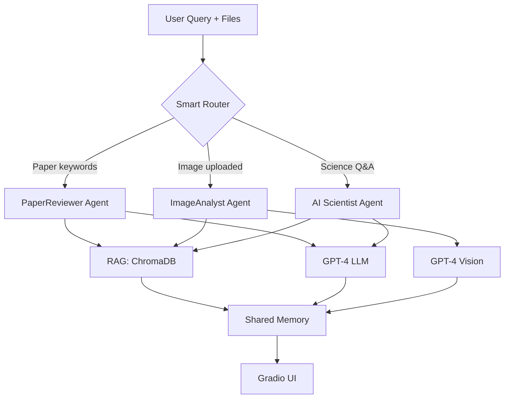

# 🔬 AI Scientist: Multi-Agent System for Biomedical Imaging

> **A modular, intelligent research assistant that combines literature search, image analysis, and paper review in one conversational interface.**

[](https://opensource.org/licenses/MIT)
[](https://www.python.org/downloads/)
[](https://langchain.com/)

The **AI Scientist** project is a multi-agent framework that unifies **retrieval-augmented generation (RAG)**, **conversational memory**, and **multimodal vision** to accelerate research in **biomedical imaging**.  

### 💡 What Makes It Special?
- 🤖 **3 Specialized AI Agents** that automatically route based on your question
- 📄 **Upload & Review Papers** - Extract and analyze PDFs instantly
- 🖼️ **Upload Microscopy Images** - Get AI-powered workflow suggestions
- 🧠 **Conversational Memory** - Agents remember context across questions
- 📚 **RAG-Powered** - Answers grounded in your scientific literature database
- 🎯 **Smart Routing** - Automatically picks the right agent for your task

---

## 🚀 Quick Demo

**Ask about literature:**
```
💬 "What are the latest techniques in adaptive optics microscopy?"
→ Routes to AI Scientist Agent
```

**Upload an image:**
```
🖼️ [Upload: cells.tif]
💬 "Design a segmentation workflow for these nuclei"
→ Routes to Image Analyst Agent
```

**Review a paper:**
```
📄 [Upload: paper.pdf]
💬 "Critique the methodology in this paper"
→ Routes to Paper Reviewer Agent
```

---

## 🧩 Architecture Overview

This system is built around specialized AI "agents," each designed for a specific research task:
- **AI_scientist_agent.py** → text-based RAG for scientific Q&A
- **Image_analyst_agent.py** → multimodal vision + RAG for workflow design
- **paper_reviewer_agent.py** → PDF analysis + RAG for paper review
- **Router** → intelligent routing based on query intent + shared memory
- **GLOBAL_MEMORY** → unified conversation context across agents

| Agent | Primary Function |
|--------|------------------|
| **AI Scientist Agent** | Literature-grounded scientific reasoning via RAG |
| **ImageAnalyst Agent** | Workflow generation and interpretation of microscopy images |
| **PaperReviewer Agent** | Scientific paper analysis, critique, and literature review with PDF support |

Each agent is implemented as a composable LangChain `Runnable` pipeline with shared memory, individual prompt templates, and retrieval logic.  
The architecture is fully extensible — future agents (e.g., `DataAnalystAgent`, or `ModelTrainerAgent`) can be added easily.

---

## 1️⃣ AI Scientist Agent
**Your literature-powered research assistant**

### What It Does
- 📚 Answers questions using your scientific literature database
- 🔍 Retrieves relevant papers and documentation via RAG
- 💬 Maintains conversation context across multiple questions
- 📖 Provides citations and grounded explanations

### Example Use Cases
- "What are the advantages of adaptive optics in microscopy?"
- "Explain the difference between confocal and two-photon imaging"
- "What papers discuss neuronal imaging in vivo?"
- "How does STED microscopy achieve super-resolution?"

---

## 2️⃣ ImageAnalyst Agent
**Multimodal vision AI for microscopy workflow design**

### What It Does
- 🖼️ Analyzes uploaded microscopy images (TIFF, PNG, JPG)
- 🔬 Understands image content using GPT-4 Vision
- 📋 Generates detailed Fiji/Python processing workflows
- 🎯 Tailors recommendations to your specific data characteristics

### Technical Capabilities
- Supports multi-channel, Z-stack, and time-series images
- Handles various microscopy formats (widefield, confocal, etc.)
- Retrieves relevant protocols from Fiji documentation database
- Provides step-by-step implementation instructions

### Example Use Cases
- Upload cells.tif → "Design a segmentation pipeline for these nuclei"
- "What preprocessing steps do I need for this noisy image?"
- "How can I quantify organelle colocalization in this data?"
- "Suggest a pipeline for tracking moving cells in this time-lapse"

---

## ImageAnalyst Agent
### **Description**
The **ImageAnalyst Agent** bridges raw microscopy data and AI-assisted workflow design.
It reads uploaded images, extracts metadata and intensity statistics, and proposes step-by-step Fiji or Python analysis pipelines tailored to the data’s characteristics.


### **Key Features**
- **Raw Image Understanding** - Accepts microscopy images.
- **Workflow Recommendation** - Suggests details Fiji or python pipeliness.
- **RAG-based Fiji Knowledge** - Retrieves plugin documentation and tutorials from a continuously updated Fiji and other open source packages knowledge base.
1. Could accept two inputs, raw image, the user goal/question/description, optionally include summary
2. vision-capable LLM
3. searches both databases (tech docs and scientific papers)
4. return: detailed fiji/python workflow, a rationale grounded in both the image and context.


## 3️⃣ PaperReviewer Agent
**Upload PDFs and get instant, evidence-based critiques**

### What It Does
- 📄 Extracts full text, tables, and figure captions from uploaded papers
- 🔍 Combines paper content with relevant literature from database
- ✍️ Provides structured reviews covering methodology, novelty, and rigor
- 💡 Offers constructive, actionable feedback

### Example Use Cases
- "Critique the experimental design in this paper"
- "Summarize recent advances in live-cell imaging"
- "What are the limitations of this methodology?"
- "Compare this approach to state-of-the-art methods"

---

## 🎯 Real-World Use Cases

### For Researchers
- 📖 **Literature Review**: "Summarize papers on STORM super-resolution microscopy"
- 🔬 **Experiment Design**: Upload image → "How should I segment these organelles?"
- 📊 **Paper Review**: Upload paper → "Is this methodology sound?"

### For Students
- 🎓 **Learning**: "Explain the principles of confocal microscopy"
- 🖼️ **Assignment Help**: Upload data → "What analysis pipeline should I use?"
- 📝 **Writing Support**: "What are the key papers on this topic?"

### For Lab Groups
- 🤝 **Knowledge Sharing**: Centralized database of lab papers and protocols
- 🔄 **Reproducibility**: Get standardized workflow recommendations
- 💬 **Quick Answers**: No more digging through papers for answers

---

# 🏗️ System Architecture



**Key Components:**
- 🎯 **Smart Router**: Intent-based routing with LLM fallback
- 🗄️ **Vector Database**: ChromaDB with scientific literature embeddings
- 🧠 **Shared Memory**: Session-aware context across all agents
- 🖼️ **Vision Support**: GPT-4 Vision for microscopy image understanding
- 💬 **Interactive UI**: Gradio web interface with streaming responses

---

# ⚡ Quick Start

### 1️⃣ Install Dependencies
```bash
pip install -r requirements.txt
```

### 2️⃣ Set Up OpenAI API Key
Create a `.env` file in the project root:
```bash
OPENAI_API_KEY=your_api_key_here
```

### 3️⃣ Build Your Knowledge Base
```bash
# Add your PDFs to data/papers/
python -m data.document_loader
```

### 4️⃣ Launch the Application
```bash
# Web UI (recommended)
python main.py

# Or CLI mode
python main.py -m cli
```

Visit `http://localhost:7860` and start chatting! 🎉

---

# 🛠️ Tech Stack

| Category | Technology |
|----------|-----------|
| **LLM** | OpenAI GPT-4, GPT-4 Vision |
| **Framework** | LangChain (agents, RAG, memory) |
| **Vector DB** | ChromaDB (document embeddings) |
| **UI** | Gradio (web interface) |
| **PDF Processing** | Docling, PyPDF |
| **Image Processing** | PIL, scikit-image, tifffile |
| **Language** | Python 3.10+ |

---

# 📊 Features Comparison

| Feature | AI Scientist | Image Analyst | Paper Reviewer |
|---------|-------------|---------------|----------------|
| Text Q&A | ✅ | ✅ | ✅ |
| Image Upload | ❌ | ✅ | ❌ |
| PDF Upload | ❌ | ❌ | ✅ |
| RAG Retrieval | ✅ | ✅ | ✅ |
| Vision Model | ❌ | ✅ | ❌ |
| Workflow Design | ❌ | ✅ | ❌ |
| Paper Critique | ❌ | ❌ | ✅ |

---

# 🤝 Contributing

Contributions are welcome! Future agent ideas:
- 📈 **DataAnalyst Agent**: Statistical analysis and visualization
- 🧬 **ProtocolAgent**: Step-by-step experimental protocols
- 🤖 **ModelTrainer Agent**: ML model training for image analysis
- 📊 **FigureGenerator Agent**: Automated figure creation from data

---

# 📜 License

MIT License - feel free to use and modify for your research!

---

# 📧 Contact

Questions? Issues? Open an issue or reach out to the maintainers!